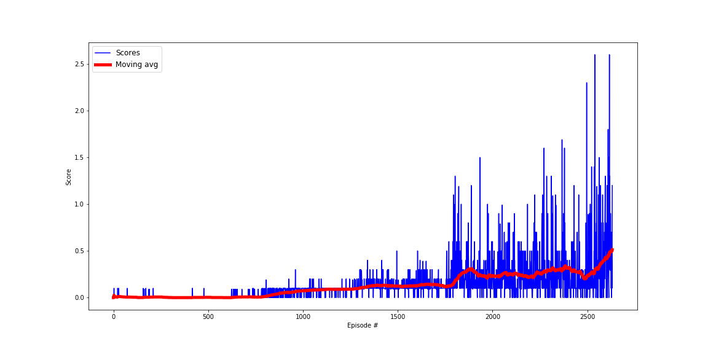

# Report: Project 3 - Collaboration and Competition

The report contains the algorithm used to train the RL agent along with the resulting plot containing
the scores obtained by the agent over the episodes.

### Learning Algorithm
Since we have two different agents competing against each other in the same environment, it will be advantageous to 
use MADDPG algorithm instead of using individual DDPG agents. MADDPG algorithm considers the behavior of the opponent 
to learn rather than naively learning by using individual DDPG agents.

#### Multi Agent Deep Deterministic Policy Gradient (MADDPG)

In this **MADDPG** implementation each agent has its own Actor Network which only takes its corresponding observations. Although each agent has its own Critic network it takes the actions of both agents as well as the observations
of both agents. Hence, the Actor network trains only by looking at what it sees while the Critic is able to learn the action value function Q(s, a) for the state, action pairs of both agents. 
This helps the agent to learn the behaviour of the opponent and act accordingly. One more improvement is done by sampling separately for each agent. This helps to make them learn independently, the disadvantage of using the same samples and then selecting their corresponding observations from
that, will most probably make one of the agent to learn the wrong moves while the other one to learn the correct moves. This might sometimes cause instability in training. After fixing this by sampling separately for the two agent training stability increased. Thus, improving the overall performance.

**Experience replay**<br/>
In this implementation the MADDPG agent holds the shared Experience Replay buffer of both RL agents.
Experience replay is achieved by storing the previous experience the RL agent had
as a state, action, reward, and next state (s, a, r, s') tuple.
These samples are randomly drawn as a training data for the neural network
in order to break the correlation between them. This helps to use the valuable experiences the agent had rather than throwing them away immediately.
In this implementation instead of learning and updating the weights at every time step, which resulted in instability during the training, the agent is made to learn after a certain steps.

**Hyper-parameters**

- BUFFER_SIZE = int(1e6)  # replay buffer size
- BATCH_SIZE = 128        # minibatch size
- GAMMA = 0.98            # discount factor
- TAU = 1e-3              # for soft update of target parameters
- LR_ACTOR = 1e-4         # learning rate of the actor 
- LR_CRITIC = 1e-3        # learning rate of the critic
- WEIGHT_DECAY = 0        # L2 weight decay 
- LEARN_TIMES = 1         # how many samples to learn
- UPDATE_EVERY = 1        # how often to update the network
- mu=0.                   # long running mean in the Ornstein-Uhlenbeck process
- theta=0.15              # speed of mean reversion in the Ornstein-Uhlenbeck process
- sigma=0.2               # volatility parameter in the Ornstein-Uhlenbeck process

**Neural Network Architecture**  
For the actor network, the state space size is 24 variables, therefore the input layer size is also 24.
The hidden layers sizes are 128 and 128 and since the action space size is 2 the output size of the NN is also 2.
The actor network uses Relu activation function for all the layers except the last layer. These layers are first batch normalized and then fed through the Relu function. For the last layer a tanh activation function is used.

The critic network takes the state space of both agents hence its size will be 48. The first layer takes the states and the output is concatenated with the actions of both agents (size will be 4) and sent to the 
second hidden layer. This will be used to estimate the action-value function hence the output size will be 1.
In the critic network the first layer is batch normalized and passed through a Relu function. Next the concatenated vector mentioned above, is passed through a Relu function and the last layer doesn't have any activation functions.
```
Actor(
  (actor_fc1): Linear(in_features=24, out_features=128, bias=True)
  (actor_bn1): BatchNorm1d(128, eps=1e-05, momentum=0.1, affine=True, track_running_stats=True)
  (actor_fc2): Linear(in_features=128, out_features=128, bias=True)
  (actor_bn2): BatchNorm1d(128, eps=1e-05, momentum=0.1, affine=True, track_running_stats=True)
  (actor_fc3): Linear(in_features=128, out_features=2, bias=True)
)
Critic(
  (critic_fcs1): Linear(in_features=48, out_features=128, bias=True)
  (critic_bn1): BatchNorm1d(128, eps=1e-05, momentum=0.1, affine=True, track_running_stats=True)
  (critic_fc2): Linear(in_features=132, out_features=128, bias=True)
  (critic_fc3): Linear(in_features=128, out_features=1, bias=True)
)
```


**Plot of Rewards**

The following plots shows the rewards per episode  
  
The agent is able to solve the environment in 2633 episodes!

```
t 290       Episode 2626 (00m15s)	Average Score: 0.4936
t 51       Episode 2627 (00m02s)	Average Score: 0.4916
t 272       Episode 2628 (00m16s)	Average Score: 0.4976
t 13       Episode 2629 (00m01s)	Average Score: 0.4947
t 202       Episode 2630 (00m11s)	Average Score: 0.4967
t 120       Episode 2631 (00m05s)	Average Score: 0.4987
t 26       Episode 2632 (00m01s)	Average Score: 0.4997
t 444       Episode 2633 (00m21s)	Average Score: 0.5117

Environment solved in 2633 episodes! (01h52m40s) 	Average Score: 0.5117
```


### Ideas for Future Work
In this project a MADDPG algorithm with a shared Experience Replay buffer and a private actor-critic networks are used. As a future work, we can add 
- Prioritized experience replay buffer
- Hindsight experience Replay
- Common Actor or Critic networks can also be used

These can help to solve this environment efficiently.
